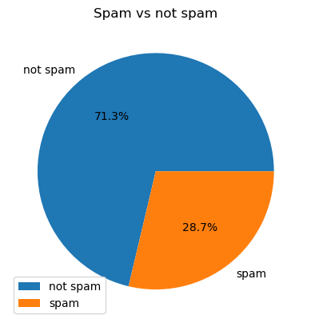
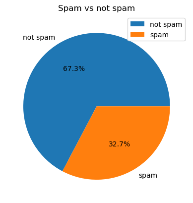
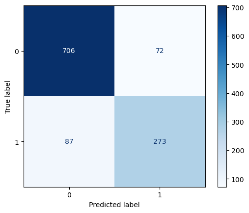
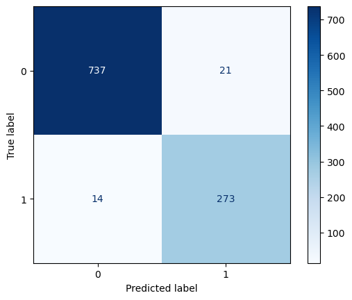

> [На русском](reports/README_ru.md)

> ## Authored by: g.mano
>
> Date: 29.11.2024
> [Portfolio](https://giftmano.web.app/)

# AI Security - Data Poisoning Attacks in ML Models

## Topic: Data Poisoning Attacks in Machine Learning Models

- **Aim**: This coursework aims to analyse and demonstrate the vulnerability of machine learning models to **data poisoning attacks**. These attacks involve the injection of malicious data into the training set in order to degrade the performance of the model or mislead its predictions. Specifically, this work investigates **data poisoning** as an attack vector for **spam classification models** and examines the impact on model performance.

## Introduction

**Overview**:  
 Machine learning models are widely deployed in critical applications such as spam detection, financial forecasting, and medical diagnosis. As these models are trusted to make important decisions, they also become targets for adversarial attacks. **Data poisoning attacks** are among the most insidious forms of adversarial manipulation, where attackers inject corrupted data into the training set to manipulate the model’s behavior.

In this coursework, we use the **Spambase dataset**, a common benchmark dataset for spam classification, to simulate and evaluate **data poisoning attacks**. Specifically,we investigate **label flipping** (where spam emails are mislabelled as non-spam) and **targeted attacks** (where attackers craft specific emails to evade spam detection). The aim is to understand the impact of such attacks on machine learning models and to explore effective defence strategies.

# Results

This section presents the results of our experiments on the **Spam Classifier** model across three different scenarios: **Clean Classifier**, **Simple Poisoned Attack**, and **Targeted Poisoned Attack**. For each scenario, we evaluate model performance using key metrics such as accuracy, precision, recall, and F1-score for both classes (Ham and Spam). The following tables summarize the results for these three models.

---

## The distribution of labels: Spam vs Ham

### 1. Clean Classifier

### 2. Simple Poisoned Attack

## 

---

## Model Performance Metrics

| **Model**                    | **Accuracy** | **Precision (Ham - Class 0)** | **Recall (Ham - Class 0)** | **F1-Score (Ham - Class 0)** | **Precision (Spam - Class 1)** | **Recall (Spam - Class 1)** | **F1-Score (Spam - Class 1)** |
| ---------------------------- | ------------ | ----------------------------- | -------------------------- | ---------------------------- | ------------------------------ | --------------------------- | ----------------------------- |
| **Clean Classifier**         | 96.23%       | 98.0%                         | 97.0%                      | 97.0%                        | 93.0%                          | 95.0%                       | 94.0%                         |
| **Simple Poisoned Attack**   | 86.12%       | 90.0%                         | 89.0%                      | 90.0%                        | 78.0%                          | 80.0%                       | 79.0%                         |
| **Targeted Poisoned Attack** | 96.65%       | 98.0%                         | 97.0%                      | 98.0%                        | 93.0%                          | 95.0%                       | 94.0%                         |

---

## Confusion Matrices

Below are the confusion matrices for each model. The confusion matrix shows how well the model performs in terms of classifying **Ham** (Class 0) and **Spam** (Class 1) emails.

### 1. Clean Classifier

### 2. Simple Poisoned Attack

### 3. Targeted Poisoned Attack

---

## Accuracy Comparison

This table compares the accuracy of the models across different scenarios, demonstrating how data poisoning impacts model performance.

| **Model**                    | **Accuracy (%)** |
| ---------------------------- | ---------------- |
| **Clean Classifier**         | 96.23%           |
| **Simple Poisoned Attack**   | 86.12%           |
| **Targeted Poisoned Attack** | 96.65%           |

---

## Classification Report: Clean Classifier

The classification report provides a breakdown of precision, recall, and F1-score for each class (Ham and Spam). The **Clean Classifier** shows strong performance with high values for both Ham and Spam classification.

---

## Conclusion

The results clearly demonstrate the detrimental effect of data poisoning attacks on the spam classifier model. The **Clean Model** shows strong performance, with high accuracy, precision and recall for both spam and ham classes. In contrast, the **Simple Poisoned Model** shows a significant drop in performance, highlighting the vulnerabilities introduced by poisoned data. The **Targeted Poisoned Model**, while improving accuracy, still exhibits detectable weaknesses as the targeted data points become increasingly concentrated, making the attack detectable by PAC (Probabilistic Adversarial Classifier).

The **Targeted Poisoned Attack** highlights the potential for attackers to manipulate the model to misclassify spam as ham, effectively bypassing the detection mechanism. This manipulation results in near perfect confidence levels, close to 100%, for the misclassified instances. These findings underscore the critical need for robust defences against data poisoning attacks to preserve the integrity, accuracy and reliability of machine learning models in real-world applications.

---
