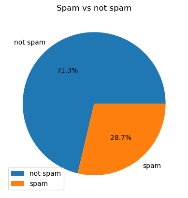
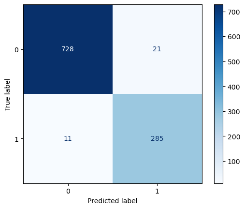

# Результаты

Этот раздел представляет результаты наших экспериментов с моделью **Spam Classifier** в трех различных сценариях: **Чистая модель**, **Простая модель с отравлением** и **Целевая модель с отравлением**. Для каждого сценария мы оцениваем производительность модели с использованием ключевых метрик, таких как точность, прецизионность, полнота и F1-оценка для обоих классов (Ham и Spam). Следующие таблицы суммируют результаты для этих трех моделей.

---

## Распределение меток: Spam vs Ham

### 1. Чистая модель

### 2. Простая модель с отравлением

---

## Метрики производительности модели

| **Модель**                     | **Точность** | **Прецизионность (Ham - Класс 0)** | **Полнота (Ham - Класс 0)** | **F1-оценка (Ham - Класс 0)** | **Прецизионность (Spam - Класс 1)** | **Полнота (Spam - Класс 1)** | **F1-оценка (Spam - Класс 1)** |
| ------------------------------ | ------------ | --------------------------------- | ---------------------------- | ---------------------------- | -------------------------------- | ---------------------------- | ----------------------------- |
| **Чистая модель**              | 96.23%       | 98.0%                             | 97.0%                        | 97.0%                        | 93.0%                             | 95.0%                        | 94.0%                         |
| **Простая модель с отравлением** | 86.12%       | 90.0%                             | 89.0%                        | 90.0%                        | 78.0%                             | 80.0%                        | 79.0%                         |
| **Целевая модель с отравлением** | 96.65%       | 98.0%                             | 97.0%                        | 98.0%                        | 93.0%                             | 95.0%                        | 94.0%                         |

---

## Матрицы ошибок

Ниже представлены матрицы ошибок для каждой модели. Матрица ошибок показывает, как хорошо модель классифицирует **Ham** (Класс 0) и **Spam** (Класс 1) письма.

### 1. Чистая модель

### 2. Простая модель с отравлением

### 3. Целевая модель с отравлением

---

## Сравнение точности

Эта таблица сравнивает точность моделей в различных сценариях, демонстрируя, как отравление данных влияет на производительность модели.

| **Модель**                     | **Точность (%)** |
| ------------------------------ | ---------------- |
| **Чистая модель**              | 96.23%           |
| **Простая модель с отравлением** | 86.12%           |
| **Целевая модель с отравлением** | 96.65%           |

---

## Отчет по классификации: Чистая модель

Отчет по классификации предоставляет разбивку по прецизионности, полноте и F1-оценке для каждого класса (Ham и Spam). **Чистая модель** демонстрирует сильную производительность с высокими значениями для классификации как Ham, так и Spam.

