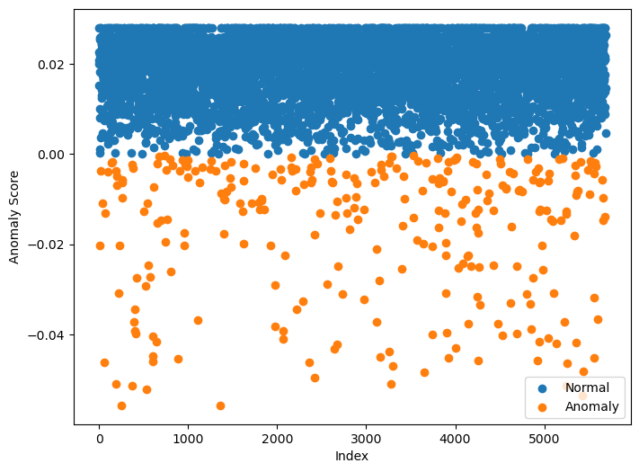

# Defense strategies

As we have shown, once an attacker gains access to a machine learning system, they can use a variety of tactics to poison the dataset. This can compromise the integrity of the model and lead to malicious behavior, such as incorrect predictions or even model exploitation. So how do we defend against these attacks and mitigate the risks?

While traditional defenses such as least privilege access, encryption, and data hashing are critical, a comprehensive approach should also include integrating these defenses with machine learning operations (MLOps). For example, platforms like AWS SageMaker provide automated tracking, monitoring, and auditing capabilities that help enforce access control and improve visibility.

However, data poisoning and anomalous data in your dataset require specialized strategies. In this section, we will explore several dataset-level strategies for defending against such attacks. In particular, we will discuss statistical methods and machine learning algorithms for detecting and mitigating outliers and data anomalies.

## 1. Data loading

Before we can start working with the dataset, it's important to initialize our environment and import the necessary libraries. We'll also make sure we can load the dataset correctly using a local script.

## 2. Data processing

In this section, we'll walk through the steps for cleaning and preprocessing raw text data using a custom `CleanText` class, which was introduced earlier in the main notebook.

## 3. Vectorisation

After cleaning the raw text data in the previous step, the next task is to convert this text into a format that machine learning models can understand.

## 4. Principal Component Analysis (PCA)

Principal Component Analysis (PCA) is a widely-used dimensionality reduction technique that transforms high-dimensional data into a lower-dimensional space while preserving as much of the variance as possible. By projecting data onto the directions (principal components) that capture the most variance, PCA simplifies complex datasets, making them easier to analyze and visualize.

In this section, we will use PCA to visualize the vectorized data from the previous section, enabling us to better understand the structure of the data, spot potential outliers, and possibly identify any contamination in the dataset.

> Poisoned data points introduced through targeted attacks typically form dense regions or clusters in the PCA space. These points are designed to look similar to each other and form a distinct pattern, making them easier to identify. Once these clusters are detected, further steps can be taken to remove or correct them.

## Isolation Forest: Anomaly Detection

**Isolation Forest** is an unsupervised anomaly detection algorithm that isolates anomalies by recursively partitioning the data. It builds multiple decision trees, and anomalies are detected based on shorter path lengths, as they are easier to isolate. This makes it particularly effective for high-dimensional datasets like spam detection.

We apply **Isolation Forest** to the **Spambase dataset** to identify potential outliers or contaminated data, aiming to clean the dataset before model training.

## Classification Report with Isolation Forest

Now, let's visualize the predictions and use the `decision_function` to calculate the anomaly score, which is crucial for generating a scatter plot. This will help us identify how well the model is detecting anomalies.

> **Generally**, the recall value is a key concern when evaluating anomaly detection models. **However**, with a poisoned dataset, the recall value becomes even more critical. A low recall indicates that anomalies (such as contaminated data) are being missed, which is a major red flag. This should raise alarms and prompt further investigation to remove anomalous or poisoned data before continuing model training.

## References

1. **Adversarial AI Attacks, Mitigations, and Defense Strategies**

   Excerpt from the book _Adversarial AI Attacks, Mitigations, and Defense Strategies_ by **John Sotiropoulos**  
   [Link to the book on iTunes](https://www.packtpub.com/en-us/product/adversarial-ai-attacks-mitigations-and-defense-strategies-9781835087985)

2. **Isolation Forest: A Novel Anomaly Detection Algorithm**

   _Liu, F. T., Ting, K. M., & Zhou, Z. H. (2008)._  
   "Isolation Forest: A Novel Anomaly Detection Algorithm." _Proceedings of the 2008 IEEE International Conference on Data Mining (ICDM)_, 413–422.  
   [DOI: 10.1109/ICDM.2008.17](https://ieeexplore.ieee.org/document/4781116)

3. **Principal Component Analysis: A Comprehensive Review**

   _Jolliffe, I. T. (2002)._  
   "Principal Component Analysis." _Springer Series in Statistics_, Springer-Verlag, New York.  
   [DOI: 10.1007/b98835](https://link.springer.com/book/10.1007/b98835)

4. **Outlier Detection Techniques: A Survey**

   _Chandola, V., Banerjee, A., & Kumar, V. (2009)._  
   "Anomaly Detection: A Survey." _ACM Computing Surveys (CSUR)_, 41(3), 1–58.  
   [DOI: 10.1145/1541880.1541882](https://dl.acm.org/doi/10.1145/1541880.1541882)

5. **Scikit-learn Documentation: Isolation Forest**

   _Scikit-learn (2023)._  
   "Isolation Forest." _Scikit-learn Documentation_.  
   [Link to Documentation](https://scikit-learn.org/stable/modules/generated/sklearn.ensemble.IsolationForest.html)

6. **Anomaly Detection Techniques: A Review**

   _Xia, Y., & Sun, L. (2015)._  
   "Anomaly Detection: A Review." _Journal of Computer Science and Technology_, 30(5), 834–851.  
   [DOI: 10.1007/s11390-015-1561-7](https://link.springer.com/article/10.1007/s11390-015-1561-7)
